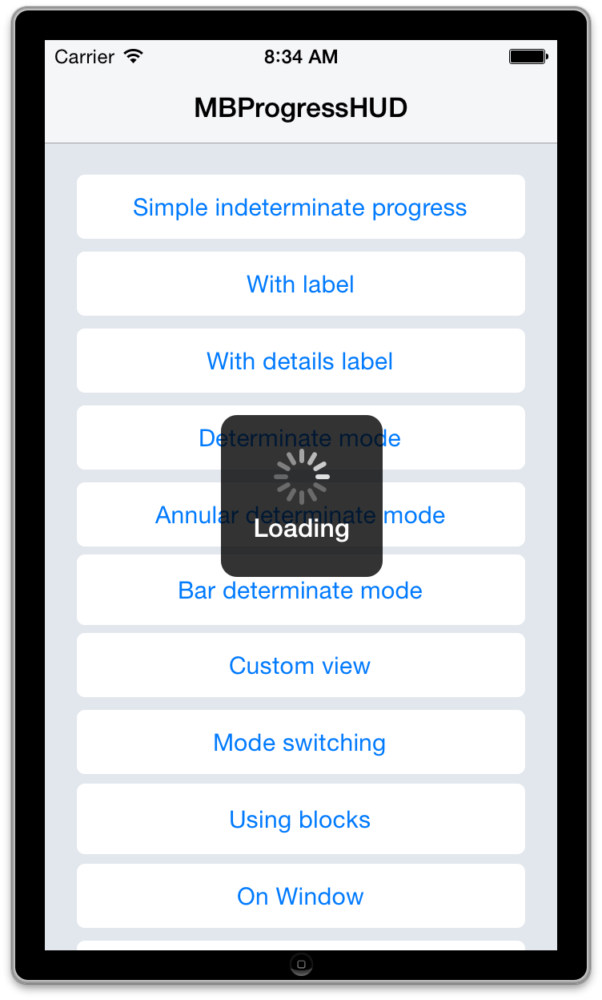

# iOS开发工具箱

## 目录
 * [前言](#前言)
 * [Xcode插件](#xcode插件)
 * [依赖包管理](#依赖包管理)
 * [网络](#网络)
 * [数据库](#数据库)
 * [日志](#日志)
 * [UI样式管理](#ui样式管理)
 * [UI布局](#ui布局)
 * [UI控件](#ui控件)

## 前言
本文档旨在整理iOS开发中实用的工具和第三方开发库。本文档列表将不断更新维护 ~

## Xcode插件
名称 | 描述 |
------ | ------ |
[XAlign][XAlign] | 用于竖向对齐  |
[VVDocumenter-Xcode][VVDocumenter-Xcode] | 喵神作品，用于快速添加注释。   |

## 依赖包管理
名称 | 描述 |
------ | ------ |
[CocoaPods][CocoaPods] | Ruby编写的命令行工具，CocoaPods manages dependencies for your Xcode projects. |

## 国际化
名称 | 描述 |
------ | ------ |
[Twine][Twine] | Ruby编写的命令行工具，Twine is a command line tool for managing your strings and their translations.  |

## 模型
名称 | 描述 |
------ | ------ |
[Mantle][Mantle] | Mantle makes it easy to write a simple model layer for your Cocoa or Cocoa Touch application. |

## 字符串处理
名称 | 描述 |
------ | ------ |
[iso-8601-date-formatter][iso-8601-date-formatter] | ISO-8601标准日期格式转换。 |

## 网络
名称 | 描述 |
------ | ------ |
[AFNetworking][AFNetworking] | 强大的网络编程框架。 |
[YTKNetwork][YTKNetwork] | 猿题库出品，对AFNetworking的高级封装。 | 
[XMPPFramework][XMPPFramework] | 实现XMPP协议。 |
[wsdl2objc][wsdl2objc] | 生产Web Service（SOAP）代码。 | 

## 数据库
名称 | 描述 |
------ | ------ |
[FMDB][FMDB] | 强大的SQLite数据库访问框架，将SQLite的C接口封装为Objective-C接口。 |

## 日志
名称 | 描述 |
------ | ------ |
[CocoaLumberjack][CocoaLumberjack] | 强大的日志框架。 |
[NSLogger][NSLogger] | 日志框架，附带一个OS X桌面日志查看工具。 |

## 测试
名称 | 描述 |
------ | ------ |
[OCMock][OCMock] | 强大的Mock框架。 |
[fir.im][fir.im] | App内测平台，FIR.im为移动开发者提供Beta App免费托管分发服务。 |

## UI样式管理
名称 | 描述 |
------ | ------ |
[NUI][NUI] | Style iOS apps with a stylesheet, similar to CSS. |

## UI布局
名称 | 描述 |
------ | ------ |
[Masonry][Masonry] | 强大的自动布局框架，纯代码做布局的不二选择。 |

## UI控件
名称 | 描述 |
------ | ------ |
[MBProgressHUD][MBProgressHUD] |  |
[JSQMessagesViewController][JSQMessagesViewController] |  |
[LBBlurredImage][LBBlurredImage] |  |
[RMStepsController][RMStepsController] |  |
[JCDialPad][JCDialPad] |  | 
[RGCardViewLayout][RGCardViewLayout] |  |
[PNChart][PNChart] |  |
[JTCalendar][JTCalendar] |  |
[FancyTabBar][FancyTabBar] |  |
[RKNotificationHub][RKNotificationHub] |  |
[SWTableViewCell][SWTableViewCell] |  |

[Xcode插件]: ""
[XAlign]:https://github.com/qfish/XAlign "XAlign"
[VVDocumenter-Xcode]:https://github.com/onevcat/VVDocumenter-Xcode "VVDocumenter-Xcode"

[依赖包管理]: ""
[CocoaPods]: https://github.com/CocoaPods/CocoaPods "CocoaPods"

[国际化]: ""
[Twine]:https://github.com/mobiata/twine "Twine"

[模型]: ""
[Mantle]:https://github.com/Mantle/Mantle "Mantle"

[字符串处理]: ""
[iso-8601-date-formatter]:https://github.com/boredzo/iso-8601-date-formatter "iso-8601-date-formatter"

[网络]: ""
[AFNetworking]: https://github.com/AFNetworking/AFNetworking "AFNetworking"
[YTKNetwork]:https://github.com/yuantiku/YTKNetwork "YTKNetwork"
[XMPPFramework]:https://github.com/robbiehanson/XMPPFramework "XMPPFramework"
[wsdl2objc]:https://code.google.com/p/wsdl2objc/ "wsdl2objc"

[数据库]: ""
[FMDB]: https://github.com/ccgus/fmdb "FMDB"

[日志]: ""
[CocoaLumberjack]: https://github.com/CocoaLumberjack/CocoaLumberjack "CocoaLumberjack"
[NSLogger]:https://github.com/fpillet/NSLogger "NSLogger"

[测试]: ""
[OCMock]:https://github.com/erikdoe/ocmock "OCMock"
[fir.im]: http://fir.im/ "fir.im"

[UI样式管理]: ""
[NUI]: https://github.com/tombenner/nui "NUI"

[UI布局]: ""
[Masonry]:https://github.com/Masonry/Masonry "Masonry"

[UI控件]: ""
[MBProgressHUD]: https://github.com/jdg/MBProgressHUD "MBProgressHUD"
[JSQMessagesViewController]:https://github.com/jessesquires/JSQMessagesViewController "JSQMessagesViewController"
[RKNotificationHub]:https://github.com/cwRichardKim/RKNotificationHub "RKNotificationHub"
[LBBlurredImage]:https://github.com/lukabernardi/LBBlurredImage "LBBlurredImage"
[RMStepsController]:https://github.com/CooperRS/RMStepsController "RMStepsController"
[JCDialPad]:https://github.com/jconst/JCDialPad "JCDialPad"
[RGCardViewLayout]:https://github.com/terminatorover/RGCardViewLayout "RGCardViewLayout"
[SWTableViewCell]:https://github.com/CEWendel/SWTableViewCell "SWTableViewCell"
[FancyTabBar]:https://github.com/marvelapp/FancyTabBar "FancyTabBar"
[PNChart]:https://github.com/kevinzhow/PNChart "PNChart"
[JTCalendar]:https://github.com/jonathantribouharet/JTCalendar "JTCalendar"