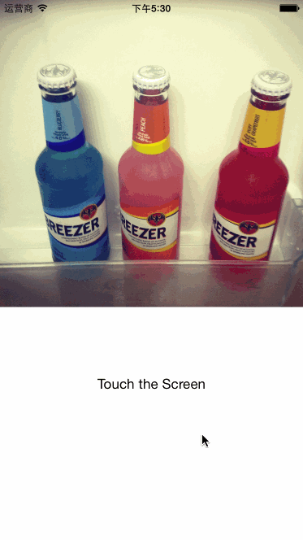
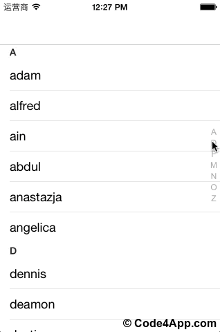

# iOS开发工具箱

## 目录
 * [前言](#前言)
 * [Xcode插件](#xcode插件)
 * [Xcode辅助](#xcode辅助)
 * [依赖包管理](#依赖包管理)
 * [国际化](#国际化)
 * [模型](#模型)
 * [字符串处理](#字符串处理)
 * [网络](#网络)
  * [XMPP协议](#xmpp协议)
  * [Web Service](#web-service)
 * [数据库](#数据库)
 * [日志](#日志)
 * [测试](#测试)
  * [单元测试](#单元测试)
  * [内测](#内测)
 * [Build](#build)
 * [交互设计](#交互设计)
 * [UI样式管理](#ui样式管理)
 * [UI布局](#ui布局)
 * [UI动画](#ui动画)
 * [UI控件](#ui控件)
  * [TextField](#textfield)
  * [TableCell](#tablecell)
  * [HUD](#hud)
  * [菜单](#菜单)
  * [旗帜](#旗帜)
  * [消息气泡](#消息气泡)
  * [上拉/下拉刷新](#上拉/下拉刷新)
  * [表格索引栏](#表格索引栏)
  * [日历](#日历)

## 前言
本文档旨在整理iOS开发中实用的工具和第三方开源库。本文档将不断更新维护 ~

## Xcode插件
项目地址 | 描述 |
------------ | ------ |
[supermarin/Alcatraz](https://github.com/supermarin/Alcatraz)    | 插件管理   |
[qfish/XAlign](https://github.com/qfish/XAlign)    | 国人作品，用于竖向对齐。   |
[onevcat/VVDocumenter-Xcode](https://github.com/onevcat/VVDocumenter-Xcode)    | 喵神作品，用于快速添加注释。   |

## Xcode辅助
项目地址 | 描述 |
------------ | ------ |
[SimPholders](http://simpholders.com/) | 帮助你快速直接地访问iPhone模拟器应用的app文件所在目录。 |

## 依赖包管理
项目地址 | 描述 |
------------ | ------ |
[CocoaPods/CocoaPods](https://github.com/CocoaPods/CocoaPods)    | iOS依赖包管理工具，命令行工具，Ruby编写。 |

## 国际化
项目地址 | 描述 |
------------ | ------ |
[mobiata/twine](https://github.com/mobiata/twine)    | 命令行工具，Ruby编写，同时支持iOS和Android。 |
[Linguan](http://www.peerassembly.com/linguan.html)（$） | GUI工具。 |

## 模型
项目地址 | 描述 |
------------ | ------ |
[Mantle/Mantle](https://github.com/Mantle/Mantle)    | Mantle makes it easy to write a simple model layer for your Cocoa or Cocoa Touch application. |

## 字符串处理
项目地址 | 描述 |
------------ | ------ |
[boredzo/iso-8601-date-formatter](https://github.com/boredzo/iso-8601-date-formatter)    | ISO-8601标准日期格式转换。 |

## 网络
项目地址 | 描述 |
------------ | ------ |
[AFNetworking/AFNetworking](https://github.com/AFNetworking/AFNetworking)     | 强大的网络编程框架。 |
[yuantiku/YTKNetwork](https://github.com/yuantiku/YTKNetwork)     | 猿题库出品，对AFNetworking的高级封装。 | 

### XMPP协议
项目地址 | 描述 |
------------ | ------ |
[robbiehanson/XMPPFramework](https://github.com/robbiehanson/XMPPFramework)    | 实现XMPP协议。 |

### Web Service
项目地址 | 描述 |
------------ | ------ |
[wsdl2objc](https://code.google.com/p/wsdl2objc/) | 生产Web Service（SOAP）代码。 | 

## 数据库
项目地址 | 描述 |
------------ | ------ |
[ccgus/fmdb](https://github.com/ccgus/fmdb)    | 强大的SQLite数据库访问框架，将SQLite的C接口封装为Objective-C接口。 |

## 日志
项目地址 | 描述 |
------------ | ------ |
[CocoaLumberjack/CocoaLumberjack](https://github.com/CocoaLumberjack/CocoaLumberjack)    | 强大的日志框架。 |
[fpillet/NSLogger](https://github.com/fpillet/NSLogger)    | 日志框架，附带一个OS X桌面日志查看工具。 |

## 测试

### 单元测试
项目地址 | 描述 |
------------ | ------ |
[erikdoe/ocmock](https://github.com/erikdoe/ocmock)    | 强大的Mock框架。 |

### 内测
项目地址 | 描述 |
------------ | ------ |
[FIR.im](http://fir.im/) | App内测平台，FIR.im为移动开发者提供Beta App免费托管分发服务。 |

## Build
项目地址 | 描述 |
------------ | ------ |
[facebook/xctool](https://github.com/facebook/xctool)    | A replacement for Apple's xcodebuild that makes it easier to build and test iOS or OSX apps. |

## 交互设计
项目地址 | 描述 |
------------ | ------ |
[facebook/origami](https://github.com/facebook/origami)    | A Quartz Composer framework that enables interactive design prototyping without programming. |

## UI样式管理
项目地址 | 描述 |
------------ | ------ |
[tombenner/nui](https://github.com/tombenner/nui)    | Style iOS apps with a stylesheet, similar to CSS. |

## UI布局
项目地址 | 描述 |
------------ | ------ |
[Masonry/Masonry](https://github.com/Masonry/Masonry)    | 强大的布局框架，纯代码做布局的不二选择。 |
[constraints.icodeforlove.com](http://constraints.icodeforlove.com/) | web应用，辅助生成约束代码。|

## UI动画
项目地址 | 描述 |
------------ | ------ |
[facebook/pop](https://github.com/facebook/pop)    | 强大的动画库。|

## UI控件
项目地址 | 描述 |
------------ | ------ |
[CooperRS/RMStepsController](https://github.com/CooperRS/RMStepsController)    |  |
[jconst/JCDialPad](https://github.com/jconst/JCDialPad)    |  | 
[terminatorover/RGCardViewLayout](https://github.com/terminatorover/RGCardViewLayout)    |  |
[kevinzhow/PNChart](https://github.com/kevinzhow/PNChart)    |  |
[marvelapp/FancyTabBar](https://github.com/marvelapp/FancyTabBar)    |  |

### TextField
项目地址 | 描述 |
------------ | ------ |
[jverdi/JVFloatLabeledTextField](https://github.com/jverdi/JVFloatLabeledTextField)    |  |

### TableCell
项目地址 | 描述 |
------------ | ------ |
[CEWendel/SWTableViewCell](https://github.com/CEWendel/SWTableViewCell)    |  |

### HUD
项目地址 | 描述 |
------------ | ------ |
[jdg/MBProgressHUD](https://github.com/jdg/MBProgressHUD)    |  |

### 菜单
项目地址 | 描述 |
------------ | ------ |
[xhzengAIB/PopMenu](https://github.com/xhzengAIB/PopMenu)    |  |
[cyndibaby905/TumblrMenu](https://github.com/cyndibaby905/TumblrMenu)    |  |

### 旗帜
项目地址 | 描述 |
------------ | ------ |
[cwRichardKim/RKNotificationHub](https://github.com/cwRichardKim/RKNotificationHub)    |  |

### 消息气泡
项目地址 | 描述 |
------------ | ------ |
[jessesquires/JSQMessagesViewController](https://github.com/jessesquires/JSQMessagesViewController)    |  |
[layerhq/Atlas-iOS](https://github.com/layerhq/Atlas-iOS)    |  |

### 上拉/下拉刷新
项目地址 | 描述 |
------------ | ------ |
[inspace-io/INSPullToRefresh](https://github.com/inspace-io/INSPullToRefresh)    |  |
[CoderMJLee/MJRefresh](https://github.com/CoderMJLee/MJRefresh)    |  |
[coolbeet/CBStoreHouseRefreshControl](https://github.com/coolbeet/CBStoreHouseRefreshControl)    |  |

### 表格索引栏
项目地址 | 描述 |
------------ | ------ |
[beyondabel/BATableView](https://github.com/beyondabel/BATableView)    |  |

### 日历
项目地址 | 描述 |
------------ | ------ |
[jonathantribouharet/JTCalendar](https://github.com/jonathantribouharet/JTCalendar)    |  |